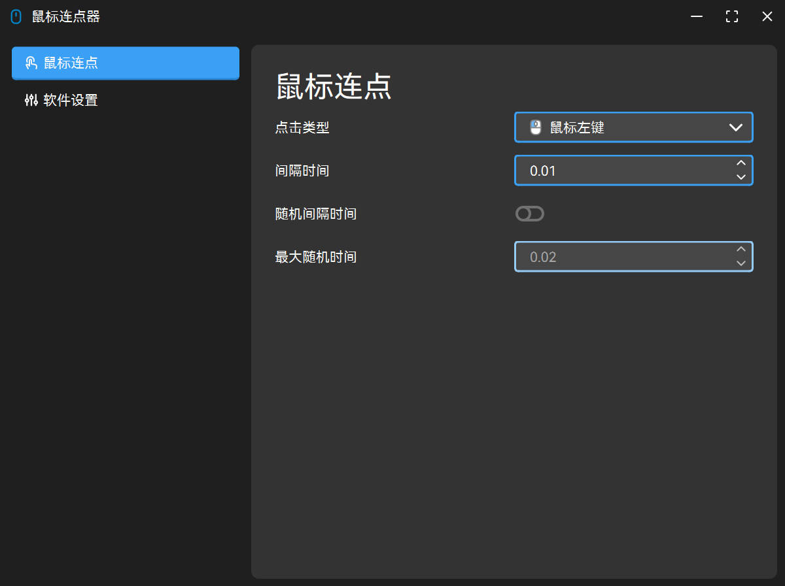
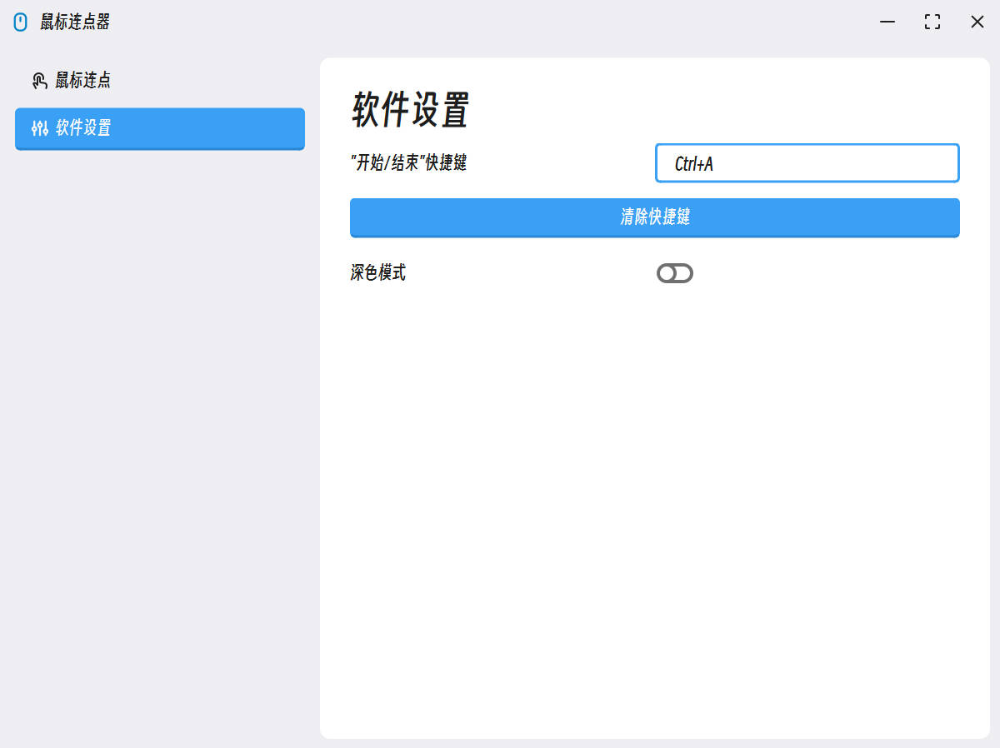
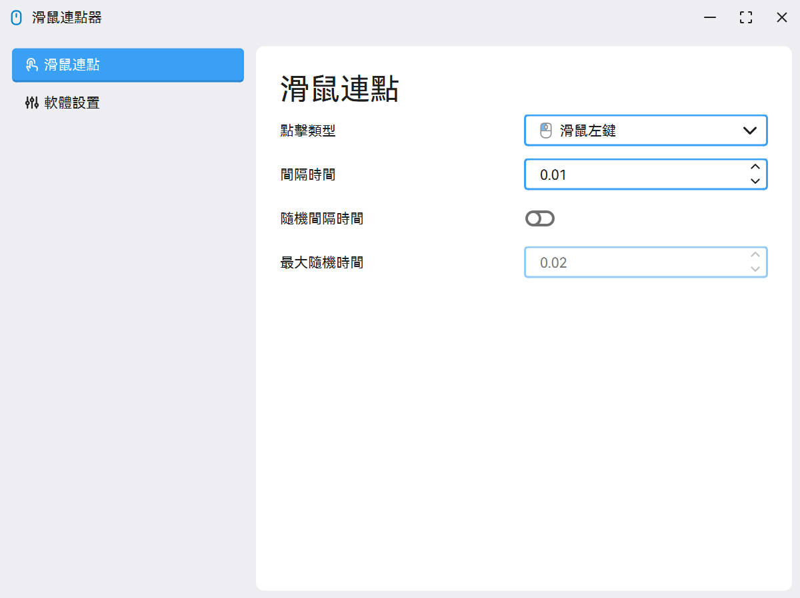
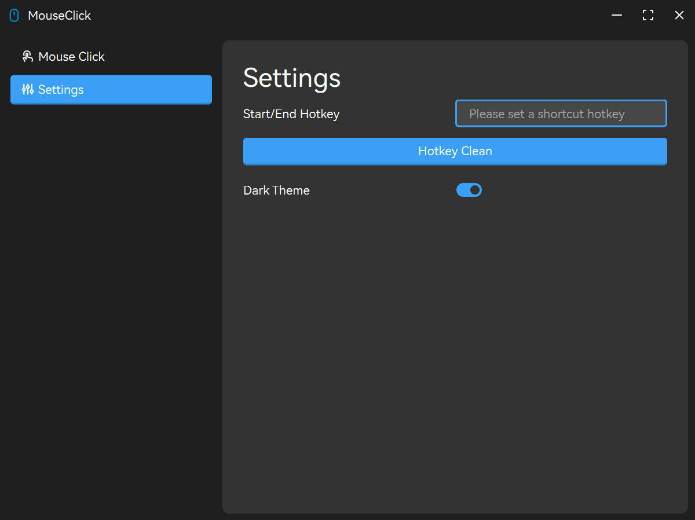
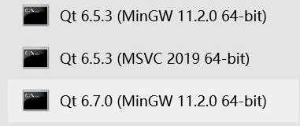

# 🐀 MouseClick

这是我学习编程的**第一个 GITHUB 项目仓库**，对我个人而言算是一个新开始，但项目本身而言还远不是结束！

# 🎉 项目重构

第二代更新了，使用 Qt6 Widget 对项目进行了完全重构，相较于之前的代码，这次的代码质量有明显提升。并且，这次真正的实现了一个相对于优美的 UI 界面，风格偏向于 [**Fluent2 Design**](https://fluent2.microsoft.design/) 那一套，但是也有不同。

下面是软件运行截图：

## 简体中文




## 繁体中文



## English



# 📋 项目计划

- [x] ~~V1 NULL~~
- [x] V2 功能
  - [x] Mouse Click
  - [ ] ~~Mouse Record~~
  - [ ] ~~Mouse Macro~~
  - [x] Settings
    - [x] 全局快捷键设置
    - [x] 黑夜模式
  - [x] 国际化(多语言支持)
    - [x] 简体中文
    - [x] English
    - [x] 繁体中文

# ⚙ 环境要求

|Component|Requirement|
|:--|:--|
|Compiler|>= C++17|
|CMake|>= 3.19|
|Qt|>= 6.7.0 ?|

# 🧤 编译项目

1. 首先先克隆本项目：
```cmd
git clone git@github.com:SeaYJ/MouseClick.git
```
2. 直接编译即可。

# 🛒 打包项目

1. 进入 **/MouseClick/build/Desktop_Qt_x_x_x_xxxxx_xxx_bit-Release/dist** 目录中，里面的文件就是打包所需全部文件（需要先编译才能看到）。
2. 打开与你编译项目时使用的编译器**版本一致**的 **Qt CMD**（例如下图），并 cd 进入该目录。

3. 执行命令 `windeployqt.exe ./MouseClick.exe`，等待命令结束即可打包成功。

## Star History

[](https://star-history.com/#SeaYJ/MouseClick&Date)

# 📄 开源证书

MouseClick（本项目）遵守 [GPL-3.0 license](https://github.com/SeaYJ/MouseClick?tab=GPL-3.0-1-ov-file) 开源证书。
