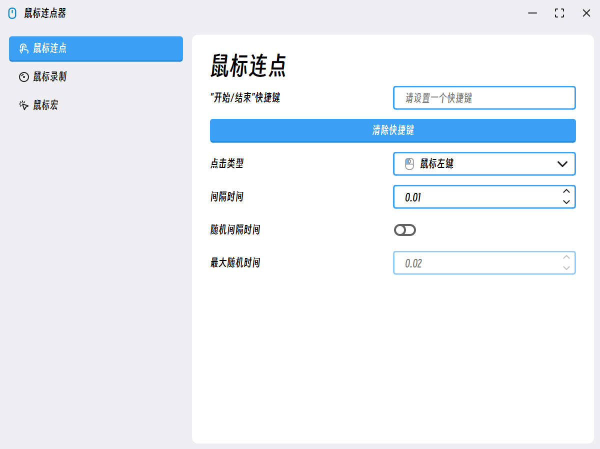

# 🐀 MouseClick

这是我学习编程的**第一个 GITHUB 项目仓库**，对我个人而言算是一个新开始，但项目本身而言还远不是结束！

# 🎉 项目重构

第二代更新了，使用 Qt6 Widget 对项目进行了完全重构，相较于之前的代码，这次的代码质量有明显提升。并且，这次真正的实现了一个相对于优美的 UI 界面，风格偏向于 [**Fluent2 Design**](https://fluent2.microsoft.design/) 那一套，但是也有不同。

下面是软件运行截图：


# 📋 项目计划

- [x] ~~V1 NULL~~
- [x] V2 功能
  - [x] Mouse Click
  - [ ] Mouse Record
  - [ ] Mouse Macro
  - [x] 国际化(多语言支持)
    - [x] 简体中文
    - [x] English
    - [ ] 繁体中文

# ⚙ 环境要求

|Component|Requirement|
|:--|:--|
|Compiler|>= C++17|
|CMake|>= 3.19|
|Qt|>= 6.7.0 ?|

# 🧤 编译项目

1. 首先先克隆本项目：
```cmd
git clone git@github.com:SeaYJ/MouseClick.git
```

2. 检查一下两个项目依赖库 CMAKE 环境是否配置正确（如果是 Qt Creator，则在“**项目-CMake-Current Configuration**”中添加）：
```CMAKE
-DQHotkey_DIR:PATH=<your_path>/MouseClick/deps/qhotkey/lib/cmake/QHotkey
```
```CMAKE
-DQWindowKit_DIR:PATH=<your_path>/MouseClick/deps/qwindowkit/lib/cmake/QWindowKit
```

3. 配置完成后，直接编译即可。

# 📄 开源证书

MouseClick（本项目）遵守 [GPL-3.0 license](https://github.com/SeaYJ/MouseClick?tab=GPL-3.0-1-ov-file) 开源证书。
