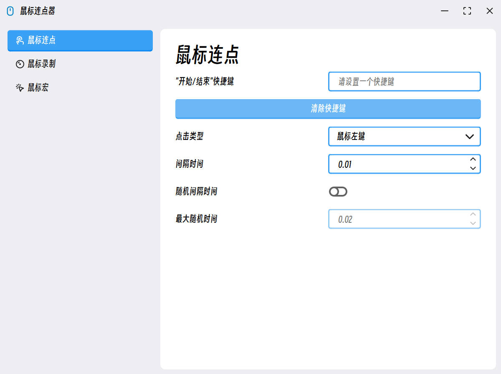

# 🐀 MouseClick

🖱️ **MouseClick** 🖱️ 是一款功能强大的鼠标控制和管理软件，采用 QT Widget 开发 🎯，具备跨平台兼容性 🌐。软件界面美观 🖼️，操作直观，支持鼠标行为模拟 💻、鼠标动作记录 📝 和宏命令创建 ⚡，让用户在工作和游戏中实现高效自动化 🚀。提升你的数字生活体验，一切尽在掌控之中 🌟！

# 🎯 软件下载

[Window 64位 V2.0.0](https://github.com/SeaYJ/MouseClick/releases/download/2.0.0/Windows_x64.zip)

# 🎉 项目重构

第二代更新了，使用 Qt6 Widget 对项目进行了完全重构，相较于之前的代码，这次的代码质量有明显提升。并且，这次真正的实现了一个相对于优美的 UI 界面，风格偏向于 [**Fluent2 Design**](https://fluent2.microsoft.design/) 那一套，但是也有不同。

下面是软件运行截图：

# 📋 项目计划

- [x] ~~V1 NULL~~
- [x] V2 功能
  - [x] Mouse Click
  - [ ] Mouse Record
  - [ ] Mouse Macro

# 📄 开源证书

MouseClick（本项目）遵守 [GPL-3.0 license](https://github.com/SeaYJ/MouseClick?tab=GPL-3.0-1-ov-file) 开源证书。
